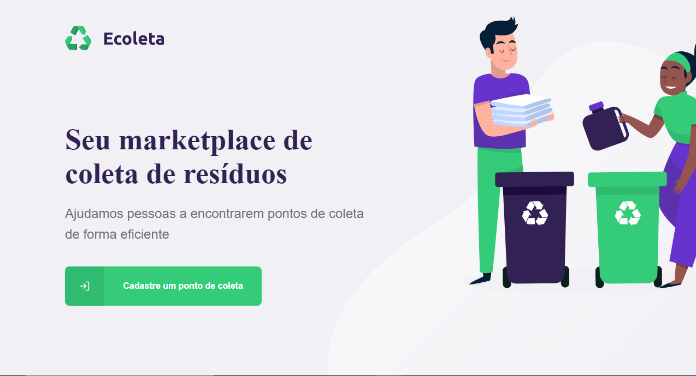
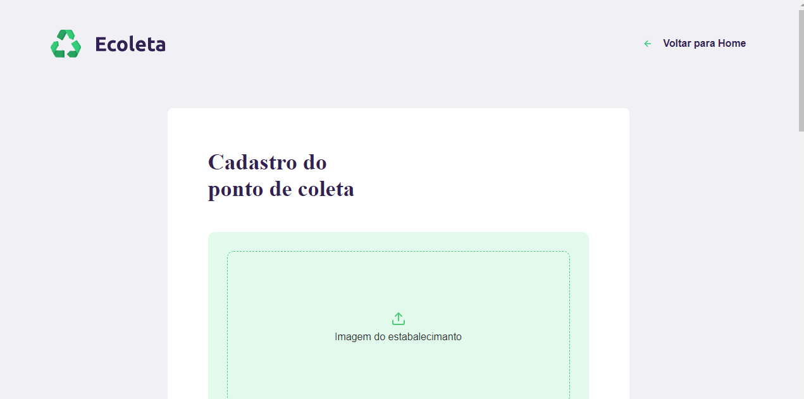

<h1 align="center" >
    
</h1>

<h3 align="center">
  Marketplaace de coleta de resíduos
</h3>

<p align="center">
  <a href="#dart-projeto">Projeto</a>&nbsp;&nbsp;&nbsp;|&nbsp;&nbsp;&nbsp;
  <a href="#mag-tecnologias">Tecnologias</a>&nbsp;&nbsp;&nbsp;|&nbsp;&nbsp;&nbsp;
    <a href="#information_source-como-usar">Como Usar</a>&nbsp;&nbsp;&nbsp;|&nbsp;&nbsp;&nbsp;
</p>


<p align="center">
  
  
  
</p>    

## :dart: Projeto
  O Ecoleta foi desenvolvido na Next Level Week evento da [Rocketseat](https://rocketseat.com.br/).
  O objetivo do projeto e ajudar os usuário a encontrarem pontos de coletas próximos à eles, Os donos de ponto de coleta podem cadastrar seu ponto no site do Ecoleta  e ele podem ser encontrado usando o app mobile.


## :mag: Tecnologias
-  [Node](https://nodejs.org/en/)
-  [React](https://facebook.github.io/react/)
-  [Expo](https://expo.io/)
-  [React-Native](https://facebook.github.io/react-native/)


## :information_source: Como Usar
Para testar o projeto, você vai precisar: [Git](https://git-scm.com), [Node.js ](https://nodejs.org/en/), [Yarn](https://yarnpkg.com/) ou [Npm](https://www.npmjs.com/)+ [Expo sdk37 ](https://expo.io/),  instalados no seu computador. Na linha de comando:

```bash
# Clone o repositório
$ git clone https://github.com/ainertec-developer/sisvep sisvep

# Entre no repositório
$ cd ecoleta

# Entre na no diretório server
$ cd server

# Instale as dependências
$ yarn 
# ou
$ npm i

# Inicie o servidor
$ yarn dev
# ou
$ npm dev

# Entre na no diretório web
$ cd ../web

# Instale as dependências
$ yarn 

# Inicie o react
$ yarn start

# Entre no diretório mobile
$ cd ../mobile

# Instale as dependências
$ yarn 

# Inicie o app
$ yarn start

```

---
Feito com :heart: por Cleiton

